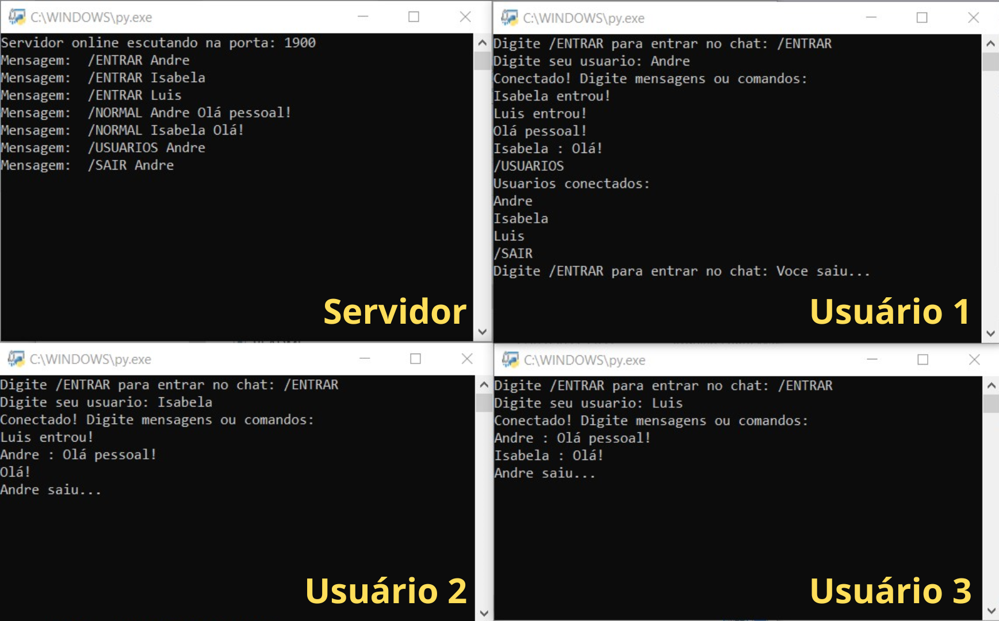

# Bate-papo

Projeto construído na disciplina de Sistemas Distribuídos do Curso de Engenharia de Computação da Universidade Federal do Ceará.

### **Requisitos do Projeto:**
Implementar um Chat usando TCP. O Chat
deve suportar múltiplos clientes e um servidor. Todos os clientes devem estar na
mesma sala do chat (i.e., as mensagens enviadas por um cliente devem ser recebidas
por todos os clientes). Comandos que o usuário (i.e., cliente) pode enviar:
1. /ENTRAR: ao usar esse comando, é requisitado o IP e porta do servidor, além
do nickname que o usuário deseja usar no chat (não precisa tratar nicknames
repetidos). Todos os usuários devem ser notificados da entrada do novo
usuário;
2. Uma vez conectado, o cliente pode enviar mensagens para a sala do chat e
deve receber todas as mensagens que forem enviadas pelos outros usuários;
3. /USUARIOS: ao enviar esse comando, o cliente recebe a lista de usuários
atualmente conectados ao chat;
4. /SAIR: ao enviar esse comando, uma mensagem é enviada à sala do chat
informando que o usuário está saindo e encerra a participação no chat.  

É papel do servidor receber as requisições dos clientes e encaminhar as mensagens
recebidas para todos eles. Descreva o formato para cada tipo de mensagem. Não pode
usar comunicação em grupo.

## 💡 Instalação & Execução
 1. Instalar o [Python](https://www.python.org/downloads/) ;
 2. Baixar o programa em *"Code > Download ZIP"* ou utilizando o comando:  
 <code>git clone https://github.com/andreluizigal/bate-papo.git</code>  
 em um terminal aberto na pasta destino; 
 3. Executar o arquivo "servidor.py";
 4. Executar o arquivo "cliente.py" para cada usuário;
 5. Digitar comandos e mensagens no programa do cliente.

## 🛠️ Tecnologias
- Python
    - Socket
    - Pickle
    - Threading
- Git

## 📞 Contato
- [andreluizigal@gmail.com 📧](mailto:andreluizigal@gmail.com)

- [(85) 99985-1991 ☎️](https://wa.me/5585999851991)
